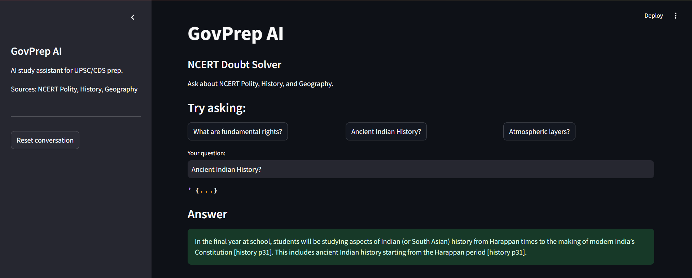

# govprep

An AI study assistant for Indian government exam aspirants (UPSC / CDS / SSC).
Ask a question in plain language and get a grounded, source-cited answer drawn
from NCERT study material — and a clear "not in my sources" when the answer
isn't there, instead of a hallucinated guess.

Built from scratch in native Python (no heavy frameworks in the core) to
understand each part of a retrieval-augmented generation (RAG) system, then
measured and tuned with a real evaluation loop rather than guesswork.



## What it does

- Answers exam-prep questions grounded **only** in the source material
- Retrieves across **multiple subjects** and tells you which book + page each
  fact came from (source attribution)
- Remembers the conversation, so **follow-up questions work**
  ("what are their powers?" resolves correctly from context)
- **Refuses to answer** when the retrieved passages don't support it — reducing
  hallucination instead of making something up
- Runs as a **web app** (Streamlit) or from the command line

## Current corpus

Currently indexed over **NCERT Class 11** textbooks (all chapters):

- **Political Science** — *Indian Constitution at Work*
- **History** — *Themes in World History*
- **Geography** — *Fundamentals of Physical Geography*

The corpus is **not fixed or limited to these PDFs** — the ingestion pipeline
loads any text-layer documents placed in the subject folders, so more subjects,
classes, and source types can be added over time. NCERT was chosen as the
starting corpus because it is core, well-structured study material for UPSC/CDS
General Studies.

## How it works

govprep has two pipelines:

**Ingestion (run once, ahead of time)**
```
PDFs  ->  text extraction  ->  chunking  ->  embeddings  ->  vector store
```

**Query (runs on every question)**
```
question + history
   -> rewrite question to be self-contained (resolves follow-ups)
   -> retrieve top-k relevant chunks across all subjects
   -> build a grounded prompt (history + passages + sources)
   -> generate answer, cited to source
   -> save the turn to memory
```

## Tech stack

- **Python 3.11+**
- **google-genai** SDK — Gemini 2.5 Flash (generation), Gemini 2.5 Flash-Lite
  (cheap query rewriting)
- **ChromaDB** — local vector database
- **sentence-transformers** (`all-MiniLM-L6-v2`) — embeddings
- **pypdf** — document loading
- **Streamlit** — web interface

## Retrieval evaluation

Retrieval quality was measured, not assumed. A 15-question gold set (across all
three subjects, each tagged with a required keyword and expected subject) is
scored with **Hit Rate@3** and **MRR**, counting a hit only when both the
correct keyword and correct subject appear.

| Config                         | Hit Rate@3 | MRR   |
|--------------------------------|------------|-------|
| Baseline (fixed 500-char)      | 0.533      | 0.433 |
| Tuned (recursive 1000/100, k=3)| 0.733      | 0.656 |

A **+37% hit rate / +52% MRR** improvement over baseline, found by sweeping
chunking strategy, chunk size, and top-k against the gold set. Full method,
results, and limitations are in [EVALUATION.md](EVALUATION.md).

## Project structure

```
govprep/
  app.py                 # Streamlit web UI
  govprep_v1.py          # command-line interface
  scripts/
    ingest_v2.py         # ingestion: load PDFs, chunk, embed, store
    chunkers.py          # recursive chunking
    retrieve_multi.py    # multi-document retrieval with metadata
    memory.py            # conversation memory
    rewrite.py           # query rewriting for follow-ups
    generate_v1.py       # the query pipeline orchestrator
    llm.py               # centralized LLM calls with retry/backoff
  eval/
    gold_set.json        # evaluation questions
    score.py             # Hit Rate@3 + MRR scorer
    sweep.py             # chunk-size sweep
    results.md           # raw experiment log
  data/
    polity/  history/  geography/   # NCERT PDFs (per subject)
  EVALUATION.md          # evaluation method + results + limitations
  README.md
```

## Setup

```bash
# 1. clone and enter the repo
git clone https://github.com/thearyangupta/govprep.git
cd govprep

# 2. create + activate a virtual environment
python -m venv venv
venv\Scripts\activate        # Windows
# source venv/bin/activate   # macOS / Linux

# 3. install dependencies
pip install -r requirements.txt

# 4. add your Gemini API key
#    create a file named .env containing:
#    GEMINI_API_KEY=your_key_here

# 5. add source PDFs (text-layer) into data/polity, data/history, data/geography
```

## Usage

**Ingest the corpus** (run once, builds the vector store):
```bash
cd scripts
python ingest_v2.py recursive govprep_v2 1000 100
```

**Run the web app:**
```bash
streamlit run app.py
```

**Or use the command line:**
```bash
python govprep_v1.py
```


## Notes

- Source PDFs and the local vector store are not committed to the repo.
- Built as a learning project to understand production-grade RAG end to end:
  retrieval, evaluation, and grounding — not just a wrapper around an LLM API.

---

