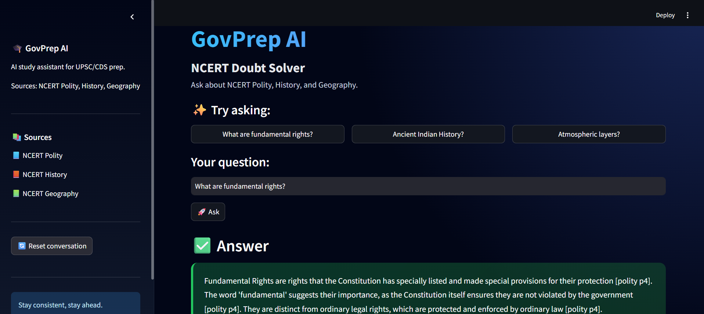

# GovPrep AI — Production RAG Assistant for Indian Government Exam Prep

Ask a government-exam question in plain language and get a grounded, source-cited answer drawn from NCERT study material — and a clear *"not in my sources"* when the answer isn't there, instead of a hallucinated guess.

Built end to end to understand production-grade retrieval-augmented generation (RAG): retrieval, evaluation, grounding, observability, and serving — not just a wrapper around an LLM API.



**🔗 Live demo:** https://govprep-frontend-64960261938.asia-south1.run.app/

> ⏳ First load may take up to a minute while the server wakes from idle.

**💻 Code:** https://github.com/thearyangupta/govprep

---

## What it does

- Answers exam-prep questions (Polity, History, Geography) grounded **only** in the source material, with source attribution.
- Refuses to answer when the retrieved passages don't support it — reducing hallucination instead of guessing.
- Runs two modes: a fixed RAG pipeline (`/chat`) and an **agentic mode** (`/chat/agent`) that routes between corpus search and live web search.
- Served as a FastAPI backend with a Streamlit web frontend.


## Architecture

```
Streamlit frontend  ──HTTP──>  FastAPI backend  ──>  RAG pipeline  ──>  Postgres + pgvector
  (frontend.py)                   (api.py)          rewrite ->            (Neon, hybrid
                                /chat, /chat/agent    guardrails ->         dense + BM25)
                                Pydantic-validated    hybrid retrieve ->
                                                      generate
```
The frontend and backend are decoupled services — the UI sends questions over HTTP and renders validated JSON; the backend owns the pipeline.

- **Backend:** FastAPI — `/chat` (Hybrid RAG pipeline), `/chat/agent` (LangGraph agent), and `/health` (health monitoring)
- **Retrieval:** Hybrid search — PostgreSQL Full-Text Search + pgvector semantic search fused using **Reciprocal Rank Fusion (RRF)**
- **Pipeline:** conversation memory → query rewriting → hybrid retrieval → grounded generation with source citations
- **Agent:** LangGraph ReAct agent with tool calling (corpus search and calculator) that reasons before generating the final answer
- **Database:** PostgreSQL (Neon) with pgvector for vector search and Full-Text Search for keyword retrieval
- **Embeddings:** Sentence Transformers (`all-MiniLM-L6-v2`) for semantic search
- **LLM:** Google Gemini 2.5 Flash
- **Frontend:** Streamlit web application communicating with the backend through REST APIs
- **Deployment:** Dockerized services deployed on Google Cloud Run with Cloud Build, Artifact Registry, and Google Secret Manager
- **Observability:** LangFuse — every agent step, tool call, token cost, and latency is traced

## Evaluation

Retrieval quality was measured, not assumed — and generation quality too. Scored against a 24-question gold set (across all three subjects, each tagged with a required keyword and expected subject).

| Layer | Metric | Score |
|-------|--------|-------|
| Retrieval | Hit Rate@3 | 0.375 |
| Retrieval | MRR | 0.243 |
| Generation | Faithfulness (LLM-as-a-judge) | 4.30 / 5 |

Retrieval uses **strict** matching (a hit counts only when the correct keyword *and* subject appear), which undercounts semantically-correct retrievals — so real-world relevance is higher than the raw number suggests. Faithfulness (4.30/5) confirms generated answers are well-grounded in the retrieved context. Full method and limitations in `EVALUATION.md`.

## How it works

**Ingestion** (run once): `PDFs → text extraction → chunking → embeddings → Postgres/pgvector`

**Query** (every question):
```
question + history
   -> rewrite to a self-contained query (resolves follow-ups)
   -> security guardrails (prompt-injection + PII checks)
   -> hybrid retrieve (dense + BM25 + RRF)
   -> build grounded prompt (passages + sources)
   -> generate answer, cited to source
```

## Current corpus

Indexed over NCERT Class 11 textbooks — Political Science (*Indian Constitution at Work*), History (*Themes in World History*), and Geography (*Fundamentals of Physical Geography*). The ingestion pipeline loads any text-layer document placed in the subject folders, so more subjects and sources can be added over time.

## 📁 Project Structure

```text
govprep/
│
├── app/
│   ├── api.py                  # FastAPI backend
│   └── frontend.py             # Streamlit frontend
│
├── src/
│   └── govprep/
│       ├── agent/              # LangGraph agent & tools
│       ├── database/           # PostgreSQL connection
│       ├── generation/         # RAG pipeline, memory & query rewriting
│       ├── ingestion/          # PDF ingestion & chunking
│       ├── retrieval/          # Hybrid retrieval (pgvector + FTS + RRF)
│       └── embeddings/         # Embedding generation
│
├── database/
│   ├── schema.sql              # PostgreSQL schema
│   └── seed.py                 # Database initialization
│
├── data/                       # NCERT PDFs (not committed)
├── tests/                      # Project tests
├── docs/                       # Documentation
│
├── Dockerfile.backend
├── Dockerfile.frontend
├── cloudbuild.backend.yaml
├── cloudbuild.frontend.yaml
│
├── requirements.txt
├── requirements-api.txt
├── requirements-frontend.txt
│
├── README.md
└── SECURITY.md
```
## Setup

```bash
# 1. clone and enter the repo
git clone https://github.com/thearyangupta/govprep.git
cd govprep

# 2. create + activate a virtual environment
python -m venv venv
venv\Scripts\activate        # Windows
# source venv/bin/activate   # macOS / Linux

# 3. install dependencies
pip install -r requirements.txt

# 4. add your Gemini API key
#    create a file named .env containing:
#    GEMINI_API_KEY=your_key_here

# 5. add source PDFs (text-layer) into data/polity, data/history, data/geography
```

## 🚀 Usage

**1. Start the backend**

```bash
uvicorn app.api:app --reload
```

The API will be available at:

```
http://127.0.0.1:8000
```

You can explore the API documentation at:

```
http://127.0.0.1:8000/docs
```

---

**2. Start the frontend**

```bash
streamlit run app/frontend.py
```

The Streamlit application will connect to the FastAPI backend and provide the web interface.

---

**3. Use the application**

Open the Streamlit app and ask questions such as:

- What are Fundamental Rights?
- Explain the Revolt of 1857.
- What are the layers of the atmosphere?

The system will:

- Rewrite follow-up questions when needed
- Perform hybrid retrieval (PostgreSQL Full-Text Search + pgvector)
- Generate a grounded answer using Gemini
- Display source citations

## Notes

- Source PDFs and the local vector store are not committed to the repo.
- Built as a learning project to understand production-grade RAG end to end: retrieval, hybrid search, evaluation, agentic workflows, prompt injection defense, grounding, and deployment.

---

